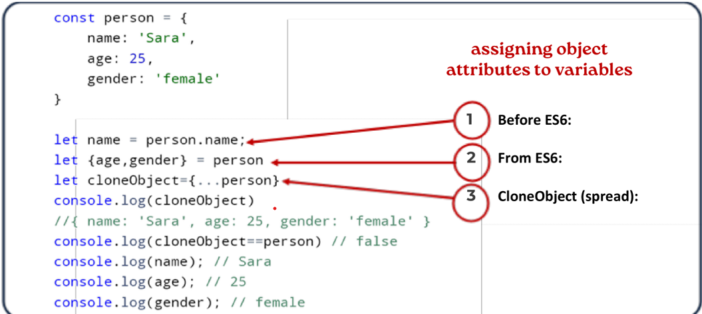

# `Что это за объект в JavaScript`

## В JavaScript объект — это самостоятельная единица, имеющая свойства и определённый тип. Сравним, например, с чашкой. У чашки есть цвет, форма, вес, материал, из которого она сделана, и т.д. Точно так же, объекты JavaScript имеют свойства, которые определяют их характеристики.

# `Как создат объект ?`
 

# `Метод объект`

 

# `1 Что такой Object.enries() ?`
## Object.entries () возвращает массив, элементами которого являются массивы, соответствующие перечисляемому свойству пары [key, value], найденной прямо в object. 

 

# `1 Что такой Object.keys() ?`

## Object.keys() — это метод в JavaScript, который возвращает массив из собственных перечисляемых свойств переданного объекта в том же порядке, в котором они перечислялись бы циклом for...in.

 

# `1 Что такой Object.values() ?`

## Метод Object.values() в JavaScript — позволяет получить все значения, заключенные в объекте. Нужно только передать имя объекта в качестве аргумента, после чего метод вернет массив, содержащий все значения этого объекта. 

 

# `Дескрипторы — это пары ключ-значение, которые описывают поведение свойства объекта при выполнении операций над ним (например, чтения или записи).`

